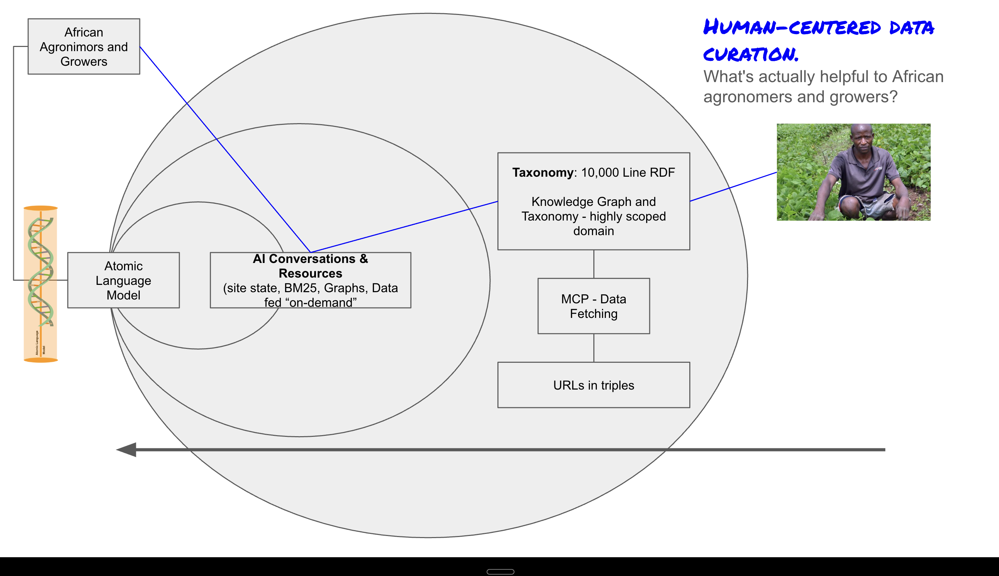

# AI-DNA-Helix-Project-Planning

**The Vision:**

This project represents a cognitive architecture that mimics the unfolding of DNA itself.

- Instead of training on snapshots of static data, the AI interacts with an adaptive graph-based taxonomy that evolves as context changes, creating a dynamic knowledge network.
- Rather than compressing knowledge into weights, it navigates and reconstructs meaning dynamically.
- Instead of retrieving answers from “inside the model,” it follows the flow of ideas, discovering emergent connections and feeding an Atomic Language Model.

Externalization of Data - Inside Out Model

**Inverting the Large Language Model: A Human-Centered AI Approach for Agronomists**  

Traditional large language models (LLMs) operate as monolithic systems, dependent on vast datasets, intensive computational resources, and static weight parameters. But what if we invert this paradigm? What if, instead of relying on a closed, high-resource AI model, we externalize the data, enabling dynamic and context-driven processing through lightweight, atomic-scale language models?  

This vision is not just theoretical—it is designed for real-world impact. Our use case centers on agronomists and growers, particularly those in the United Nations and across Africa, who need AI-driven insights but lack access to massive GPU clusters. The solution? A **decentralized, lightweight AI infrastructure** that operates on-demand, pulling curated knowledge rather than memorizing it.  

**How It Works**  
1. **Externalized Knowledge Base:** Instead of embedding all information within a model’s static weights, we structure and retrieve knowledge dynamically from a **highly scoped domain**—a 10,000-line RDF taxonomy and knowledge graph that adapts in real time.  
2. **Atomic Language Models:** These models are designed for efficiency, operating at a fraction of the size of traditional LLMs. Rather than trying to “know everything,” they specialize in fetching, interpreting, and delivering targeted insights.  
3. **On-Demand AI Conversations:** By integrating with BM25 search, structured graphs, and real-time data, AI interactions become more precise, contextual, and useful—tailored specifically to what agronomists need in the field.  
4. **Human-Centered Data Curation:** The goal is not just automation but usefulness. The system is designed to **prioritize what is actually helpful** to agronomists, ensuring the insights align with real-world agricultural needs.  
5. **Lightweight Processing, Broader Accessibility:** By shifting computation away from heavy model inference and onto structured retrieval, we make AI insights accessible **without requiring high-end GPUs or cloud-based supercomputing.**  

### **The Bigger Vision**  
This approach **redefines how AI serves knowledge**—moving away from the brute-force power of massive models toward **intelligent, efficient, and highly contextualized AI.** For agronomists and growers working in regions with limited computational resources, this means access to **on-demand, curated, and precise agricultural intelligence—when and where they need it.**  

The future of AI is **not just about bigger models, but smarter, more accessible systems.** This is **human-centered AI**, built for real-world impact.  

