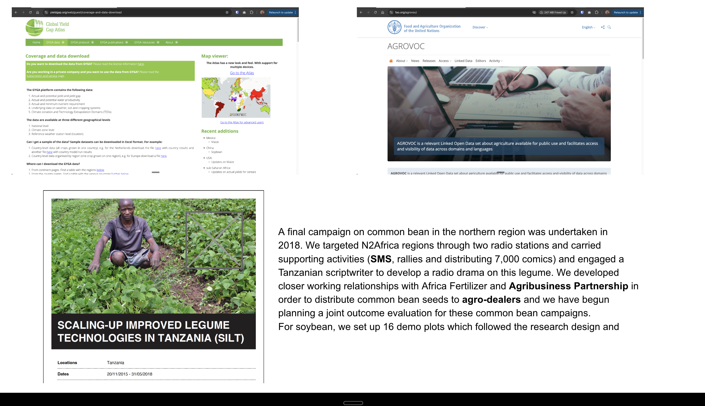

# Data Curation for African Growers

Data curation is essential for ensuring that agricultural data is organized, maintained, and made accessible to stakeholders, particularly in specific domains such as African agriculture. This involves collecting, managing, and preserving data to support decision-making and enhance agricultural practices.

## Importance of Data Curation

In the context of African growers, effective data curation can lead to improved agricultural outcomes. For instance, a campaign on common beans in the northern region was undertaken in 2018, targeting N2Africa regions through two radio stations. This campaign included various supporting activities such as SMS outreach, rallies, and the distribution of 7,000 comics. Additionally, a Tanzanian scriptwriter was engaged to develop a radio drama focused on this legume.

Through partnerships with organizations like the Africa Fertilizer and Agribusiness Partnership, common bean seeds were distributed to agro-dealers, fostering closer working relationships and enhancing the availability of resources for farmers.

## Key Websites for African Growers

Here are some important websites that provide valuable information and resources for African growers:

1. [Website 1](#) - Description of the website and its relevance.
2. [Website 2](#) - Description of the website and its relevance.
3. [Website 3](#) - Description of the website and its relevance.
4. [Website 4](#) - Description of the website and its relevance.

## Examples of Data Curation

For more examples of data curation in agriculture, please refer to the following resources:
- [Link to Examples](#)

This approach to data curation not only supports agricultural practices but also empowers growers with the knowledge and tools they need to succeed in their endeavors.