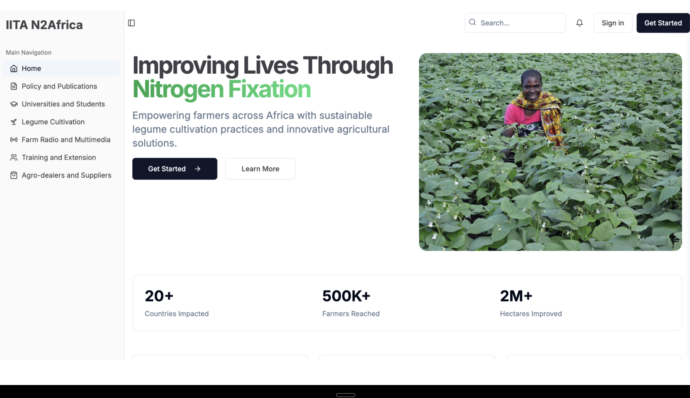

# Local Grower Meetups

Local grower meetups play a crucial role in fostering collaboration and sharing among agricultural stakeholders. These gatherings, which include policy meetings, publication planning workshops, write-shops, and final policy workshops, provide a platform for growers to come together and discuss important topics.

## Meetings and Workshops

Throughout the project, we held two policy meetings and began drafting two policy briefs. Additionally, we organized one publication planning workshop in Nairobi and one write-shop aimed at producing guidelines for investors in development communication in Arusha.

A final policy workshop was conducted in collaboration with the Africa Fertilizer and Agribusiness Partnership and Farm Radio International in Arusha, Tanzania. This workshop focused on developing recommendations for dissemination approaches and creating an enabling environment for the adoption of improved legume technologies.

## Training and Support

As part of our efforts, we trained 111 extension officers and agro-dealers in the use of legume inputs. We also conducted a student workshop to share experiences and findings in preparation for manuscript development, supporting the work of five MSc students in their studies.

The application serves as a comprehensive platform where growers can log in, track meetings, and continue their conversations. Each user has their own profile, allowing them to collaborate on meeting notes and share important documents. This functionality enhances the effectiveness of local grower meetups, making it easier for participants to stay connected and informed.

These initiatives, combined with the application, are vital for enhancing agricultural practices and ensuring that growers have access to the knowledge and resources they need to succeed.